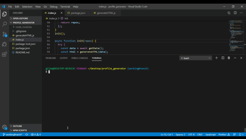

# DeveloperProfileGenerator

## Summary 
This is a command-line application that dynamically generates a PDF profile from a GitHub username. The application will be invoked with the following command: node index.js. The user will be prompted for a GitHub Username and favorite color, which will be used as the background color for cards. The PDF will be populated with the following:

- Profile image
- User name
- User bio
- Number of public repositories
- Number of followers
- Number of GitHub stars
- Number of users following
- ### Links to the following:
    - User location via Google Maps
    - User GitHub profile
    - User blog

## Demo

## Link to Repo

[Link](https://github.com/GilSolis/profile_generator)

##  NPM/API/Technologies Used

### Inquirer npm

https://www.npmjs.com/package/inquirer 

Running the application from the command line will require some user input (github username and favorite color).

### HTML-PDF npm
https://www.npmjs.com/package/html-pdf

The most approachable way to create a .pdf file would be to first generate some html. 

### GitHub Developer API

In order to create the content necessary for the pdf, information from github is pulled. All the information we need is available through the github api: https://developer.github.com/v3 via two different endpoints:

https://developer.github.com/v3/users/#get-a-single-user - Users Endpoint

https://developer.github.com/v3/repos/ - Repos Endpoint

### Axios

The ajax-like functionality of axios (https://www.npmjs.com/package/axios) is used to call the endpoints.

## License

MIT License

Copyright (c) 2020, Daria Naumova.

Permission is hereby granted, free of charge, to any person obtaining a copy
of this software and associated documentation files (the "Software"), to deal
in the Software without restriction, including without limitation the rights
to use, copy, modify, merge, publish, distribute, sublicense, and/or sell
copies of the Software, and to permit persons to whom the Software is
furnished to do so, subject to the following conditions:

The above copyright notice and this permission notice shall be included in all
copies or substantial portions of the Software.

THE SOFTWARE IS PROVIDED "AS IS", WITHOUT WARRANTY OF ANY KIND, EXPRESS OR
IMPLIED, INCLUDING BUT NOT LIMITED TO THE WARRANTIES OF MERCHANTABILITY,
FITNESS FOR A PARTICULAR PURPOSE AND NONINFRINGEMENT. IN NO EVENT SHALL THE
AUTHORS OR COPYRIGHT HOLDERS BE LIABLE FOR ANY CLAIM, DAMAGES OR OTHER
LIABILITY, WHETHER IN AN ACTION OF CONTRACT, TORT OR OTHERWISE, ARISING FROM,
OUT OF OR IN CONNECTION WITH THE SOFTWARE OR THE USE OR OTHER DEALINGS IN THE
SOFTWARE.
